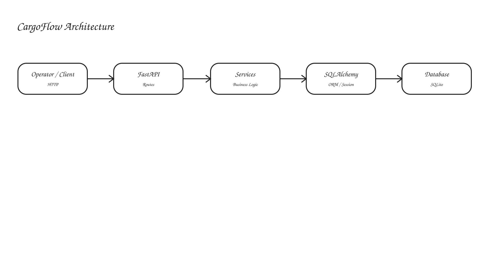

# CargoFlow

CargoFlow is a terminal cargo and container management backend built with FastAPI.

The system is being developed around a real-world container-terminal workflow:

**arrival → yard storage → movement → departure**

The long-term goal is to give terminal operators a single backend for tracking containers, vessels, yard positions, cargo movements, operational reports, and eventually intelligent yard-placement decisions.

## Product scope

CargoFlow will evolve through these areas:

- Container and cargo registration
- Vessel and shipment tracking
- Terminal yard and container-position management
- Arrival, storage, loading, and delivery events
- Cargo movement history and audit trails
- Yard occupancy and operational views
- Excel-based operational reports
- Yard placement recommendations and optimization

The project is being built incrementally. The current release is the foundation for these capabilities.

## Architecture

The backend follows a layered structure:

**Client → FastAPI → Services → SQLAlchemy → Database**

As CargoFlow grows, domain modules such as cargo, vessels, yard, movements, and reporting will be added without replacing the existing foundation.

## Current features

- FastAPI REST API
- SQLAlchemy database layer
- SQLite for local development
- Alembic database migrations
- User creation and search
- Duplicate-email validation
- Password hashing with Argon2
- JWT access-token authentication
- Isolated SQLite test database
- GitHub Actions CI
- Docker and Docker Compose

## Planned roadmap

### Phase 0 — CargoFlow foundation
Establish the product identity, domain language, and project documentation.

### Phase 1 — Cargo and container management
Introduce containers, customers, statuses, and cargo search/filtering.

### Phase 2 — Terminal yard
Model blocks, bays, rows, tiers, capacity, and container positions.

### Phase 3 — Cargo movement
Record arrivals, yard movements, loading, delivery, and complete container history.

### Phase 4 — Vessels and shipments
Connect containers to vessels, voyages, shipments, ports, and schedules.

### Phase 5 — Operations
Add terminal-level operational views and yard occupancy metrics.

### Phase 6 — Reporting
Generate Excel reports for cargo movements, arrivals, departures, yard inventory, and vessel operations.

### Phase 7 — Yard placement engine
Recommend valid storage positions for incoming containers using operational rules.

### Phase 8 — Optimization / ML
Experiment with search, mathematical optimization, machine learning, or hybrid placement strategies to reduce reshuffles.

### Phase 9 — Production engineering
Move toward PostgreSQL, background jobs, observability, stronger access control, and deployment.

## Project structure

~~~text
app/
  core/
    config.py
  db/
    base.py
    database.py
  models/
    user.py
  routers/
    auth.py
    health.py
    users.py
  schemas/
    auth.py
    user.py
  services/
    auth.py
    user.py
  security.py
  main.py

alembic/
  versions/
tests/
  conftest.py
  test_main.py
  test_users.py
  test_auth.py
docs/
  architecture.svg
~~~

## Run locally

~~~bash
python -m venv .venv
source .venv/bin/activate
pip install -r requirements-dev.txt
cp .env.example .env
alembic upgrade head
uvicorn app.main:app --reload
~~~

The API is available at http://127.0.0.1:8000 (version 0.6.0).

### Current endpoints

- GET / — API status
- GET /health — health check
- GET /users — list users, optionally filter with ?name=...
- GET /users/{user_id} — get a user
- POST /users — create a user
- POST /auth/register — register a user
- POST /auth/login — obtain a JWT
- GET /auth/me — get the authenticated user
- /docs — interactive Swagger UI

## Authentication

Register:

~~~json
{
  "name": "Ada Lovelace",
  "email": "ada@example.com",
  "password": "correct-horse-battery"
}
~~~

Login with the same credentials at POST /auth/login, then send the returned token as:

~~~text
Authorization: Bearer <access_token>
~~~

Set a strong JWT_SECRET_KEY in .env for anything beyond local development.

## Database migrations

Create a new migration after changing SQLAlchemy models:

~~~bash
alembic revision --autogenerate -m "describe the change"
alembic upgrade head
~~~

Rollback one migration:

~~~bash
alembic downgrade -1
~~~

## Test

~~~bash
pytest
~~~

Tests use an isolated in-memory SQLite database and do not write to the application's app.db.

## Docker

~~~bash
docker compose up --build
~~~

The container runs database migrations before starting Uvicorn.
